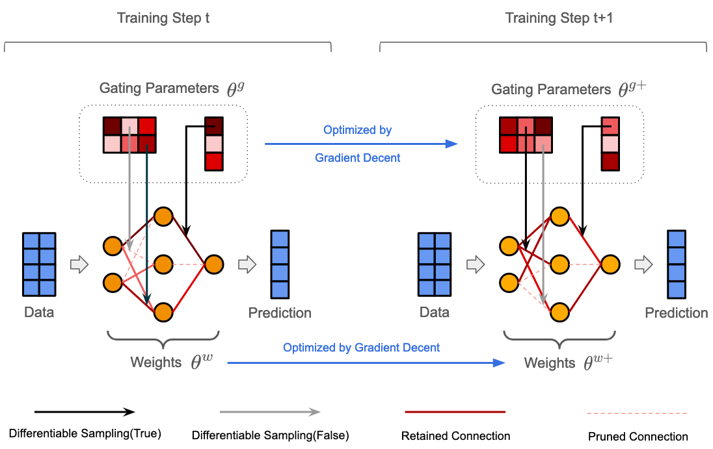
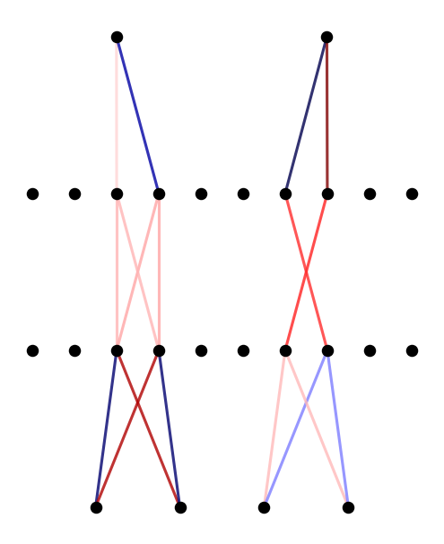

# Neural Network Pruning by Gradient Descent

This repository will contain the PyTorch implementation of:
<br>

**Neural Network Pruning by Gradient Descent**<br>
Zhang Zhang<sup>\*</sup>, Ruyi Tao, Jiang Zhangyejiu<sup>\*</sup><br>

(<sup>\*</sup>: Corresponding author) <br>
[Download PDF](https://arxiv.org/pdf/2311.12526.pdf)<br>

<p align="center">
  
</p>


### Abstract: 

The rapid increase in the parameters of deep learning models has led to significant costs, challenging computational efficiency and model interpretability. In this paper, we introduce a novel and straightforward neural network pruning framework that incorporates the Gumbel-Softmax technique. This framework enables the simultaneous optimization of a network's weights and topology in an end-to-end process using stochastic gradient descent. Empirical results demonstrate its exceptional compression capability, maintaining high accuracy on the MNIST dataset with only 0.15\% of the original network parameters. Moreover, our framework enhances neural network interpretability, not only by allowing easy extraction of feature importance directly from the pruned network but also by enabling visualization of feature symmetry and the pathways of information propagation from features to outcomes. Although the pruning strategy is learned through deep learning, it is surprisingly intuitive and understandable, focusing on selecting key representative features and exploiting data patterns to achieve extreme sparse pruning. We believe our method opens a promising new avenue for deep learning pruning and the creation of interpretable machine learning systems.

### Requirements

- Python 3.7.0
- Pytorch 2.0.1

### To Understand how our model works, please see this tutorial:

[Tutorial Here](https://github.com/3riccc/neural_pruning/blob/master/a_simple_tutorial_for_pruning.ipynb)
<p>From this turorial, you will see how to prun the network to show the relationship between features and labels directly.</p>
<p>Like the figure shows below:</p>
<p align="center">
  
</p>

### Cite
If you use this code in your own work, please cite our paper:
```
Zhang, Zhang, Ruyi Tao, and Jiang Zhang. "Neural Network Pruning by Gradient Descent." arXiv preprint arXiv:2311.12526 (2023).
```